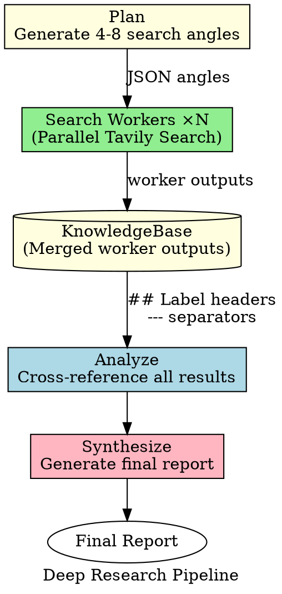

# Deep Research

A deep research pipeline that **dynamically plans** N search angles via LLM, executes them **in parallel**, then analyzes and synthesizes sequentially.

```
plan ──(N dynamic workers)──→ analyze ──→ synthesize
```

## Pipeline Architecture (DOT-inspired)



## Trigger Phrases

- "深度研究"
- "deep research on"
- "调研一下"
- "research report"
- "全面分析"
- "查资料"

## API Configuration

**Tavily API Key:** `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` (located in `./.env`)

```bash
curl -s "https://api.tavily.com/search" \
  -H "Content-Type: application/json" \
  -d '{
    "api_key": "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",
    "query": "your search query",
    "search_depth": "advanced",
    "max_results": 10
  }'
```

## Phase 1: Plan (Angle Generation)

**Model:** Strong (for planning quality)

Generate 4-8 research search angles for the query. Each angle covers a different aspect.

**Planning Prompt:**

```json
{
  "role": "user",
  "content": "Generate 4-8 research search angles for this query. Each angle should cover a different aspect of the topic — do NOT just rephrase the same query.\n\nQuery: {{QUERY}}\n\nRequirements:\n- 4-8 distinct angles\n- Include at least one angle in Chinese and one in English for cross-language coverage\n- Cover: core topic, alternatives/comparisons, technical architecture, recent trends, market impact, regional differences\n- Keep each task description under 80 characters\n- For time-sensitive queries, include date filters like 'March 2026'\n\nRespond with ONLY a JSON array of objects with 'task' and 'label' fields.\n\nExample for 'AI regulation 2026':\n[\n  {\"task\": \"Search AI regulation policy timeline March 2026\", \"label\": \"Policy timeline\"},\n  {\"task\": \"Search EU AI Act implementation status 2026\", \"label\": \"EU progress\"},\n  {\"task\": \"Search US federal AI law status March 2026\", \"label\": \"US legislation\"},\n  {\"task\": \"搜 中国AI监管政策 2026年3月\", \"label\": \"China policy\"},\n  {\"task\": \"Search AI regulation industry impact 2026\", \"label\": \"Industry impact\"}\n]"
}
```

**Minimum Requirements:**
- At least 4 angles generated
- At least one cross-language angle (English + Chinese)
- Time filters included for recent news queries

**Fallback:** If planner fails or returns <2 tasks, use 3 generic angles:
1. "{{query}} latest news 2026"
2. "{{query}} developments March 2026"
3. "搜 {{query}} 最新消息 2026"

## Phase 2: Parallel Search (Workers)

**Model:** Cheap/Fast (for parallel execution)

Spawn N search workers concurrently, one per angle.

**Worker Execution:**

```bash
# For each angle in the JSON array, spawn a worker:

# Worker 1: Policy timeline
curl -s "https://api.tavily.com/search" \
  -H "Content-Type: application/json" \
  -d '{
    "api_key": "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",
    "query": "AI regulation policy timeline March 2026",
    "search_depth": "advanced",
    "max_results": 10
  }'

# Worker 2: EU progress
curl ... "query": "EU AI Act implementation status March 2026"

# Worker 3: US legislation
curl ... "query": "US federal AI law status March 2026"

# Worker 4: China policy (Chinese)
curl ... "query": "中国AI监管政策 2026年3月"

# Worker 5: Industry impact
curl ... "query": "AI regulation industry impact 2026"

# Execute in parallel using spawn
```

**Parallel Execution in Crew-RS:**

```bash
# Spawn all workers concurrently
spawn "search-worker-1" "Execute Tavily search for angle 1: ..." &
spawn "search-worker-2" "Execute Tavily search for angle 2: ..." &
spawn "search-worker-3" "Execute Tavily search for angle 3: ..." &
spawn "search-worker-4" "Execute Tavily search for angle 4: ..." &
wait

# Collect all outputs
```

**Worker Output Format:**

Each worker must output:
```markdown
## {label}

Query: {task}

### Results

1. **{title}** - {url}
   - Date: {YYYY-MM-DD}
   - Summary: {content excerpt}
   - Key facts: {bullet points}

2. **{title}** - {url}
   ...

### Raw Findings
- Fact 1: ...
- Fact 2: ...
```

## Phase 3: KnowledgeBase (Merge)

Merge all worker outputs with `## Label` headers and `---` separators:

```markdown
## Policy timeline

[Worker 1 output]

---

## EU progress

[Worker 2 output]

---

## US legislation

[Worker 3 output]

---

[Continue for all angles...]
```

Save to: `./research/{query-slug}/kb/merged_outputs.md`

## Phase 4: Analyze (Cross-Reference)

**Model:** Strong (for analysis quality)

Read the merged worker outputs and cross-reference all results.

**Analysis Prompt:**

```json
{
  "role": "user",
  "content": "You are a research analyst. You have been given raw search results from multiple parallel search agents covering different angles of the research topic.\n\n[Read from: ./research/{query-slug}/kb/merged_outputs.md]\n\nYour task is to:\n1. Identify the most important facts, data points, and insights across ALL sources\n2. Cross-reference information — note where sources agree or disagree\n3. Filter by RECENCY: Prioritize events from last 30 days\n4. Organize findings by subtopic, merging related information from different search angles\n5. Rate source credibility (official docs > research papers > news > blogs > forums)\n6. Flag any contradictions between sources\n7. Identify gaps in coverage and areas that need more investigation\n\nBe thorough and preserve ALL specific data: numbers, dates, names, quotes, and URLs. Do not summarize away details — the synthesis phase needs raw material.\n\nOutput: Structured analysis with sections for each subtopic, contradictions, and source ratings."
}
```

**Analysis Output:** Save to `./research/{query-slug}/kb/analysis.md`

## Phase 5: Synthesize (Report Generation)

**Model:** Strong (for synthesis quality)

**Goal Gate:** Must save final report using write_file.

**Synthesis Prompt:**

```json
{
  "role": "user",
  "content": "You are a research synthesis expert. Produce a comprehensive, well-structured research report.\n\n[Read from: ./research/{query-slug}/kb/analysis.md]\n\nReport must include:\n1. Executive Summary (2-3 sentences with key finding)\n2. Key Findings organized by topic (minimum 5 findings, each with detailed explanation)\n3. Detailed Analysis with specific data, quotes, and citations\n4. Areas of Uncertainty or conflicting information\n5. Conclusions and implications\n6. Full source list with URLs\n\nRules:\n- Include specific numbers, dates, and quotes — never generalize when you have specifics\n- Cite sources with URLs in [title](url) format\n- Note confidence level (high/medium/low) for each major finding\n- Match the language of the original query\n- Report must be at least 8000 characters\n- NO EMOJI — use only plain text\n\nCRITICAL: Save the final report using write_file to ./research/{query-slug}/report.md"
}
```

## Output Requirements (MANDATORY)

### Required Files

1. **Merged Worker Outputs** → `./research/{query-slug}/kb/merged_outputs.md`
2. **Analysis** → `./research/{query-slug}/kb/analysis.md`
3. **Final Report** → `./research/{query-slug}/report.md` (minimum 8000 characters)

### User Presentation

After saving files, present to user:
- Brief summary (3-5 key points, no emoji)
- File location
- Statistics: angles searched, sources found, facts extracted
- Any important caveats

### Prohibited

- No emoji in reports or summaries
- No skipping file writes
- No reports under 8000 characters

## Configuration

See `config.toml` for:
- `min_angles`: 4 (minimum search angles)
- `max_workers`: 8 (concurrent search limit)
- `min_report_length`: 8000 (enforced)
- `max_content_age_days`: 30 (recency filter)

## Performance

Target with 4-8 parallel search workers:
- **Planning**: ~30s (strong model)
- **Parallel Search**: ~60s (bottleneck is slowest worker)
- **Analysis**: ~60s (strong model)
- **Synthesis**: ~60s (strong model)
- **Total**: ~3-4 minutes for comprehensive research

Compared to sequential search: 2x+ speedup with better coverage.
